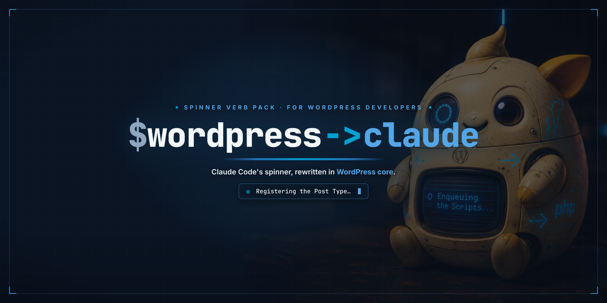

<div align="center">



<br><br>

**Claude Code's spinner, rewritten in WordPress core.**

A spinner verb pack for **WordPress developers using Claude Code**. It swaps Claude's
default "thinking" words (*Frolicking… Percolating…*) for real **WordPress core functions,
WP-CLI commands, hooks, and plugin lore**, all bent into gerunds: **Enqueuing the Scripts…**,
**Running Search-Replace…**, **Capital-P-Dangiting…**.

[](LICENSE)
&nbsp;
&nbsp;
&nbsp;

<p></p>

<a href="https://russellenvy.github.io/wordpress-claude/"><b>russellenvy.github.io/wordpress-claude</b></a>

<p>By <a href="https://russellenvy.com">RUSSΞLL AARØN</a></p>

</div>

---

## What is this?

If you build WordPress with **Claude Code** (or any AI coding tool), this is the fun part.
`$wordpress->claude` rewrites Claude Code's terminal "thinking" spinner so that instead of
generic gerunds, it shows the WordPress work you actually live in, pulled straight from
**WordPress core, WP-CLI, and the plugin ecosystem**:

- `wp_enqueue_scripts` → *Enqueuing the Scripts*
- `register_post_type` → *Registering the Post Type*
- `wp search-replace` → *Running Search-Replace*
- `$wpdb->prepare` → *Preparing the wpdb Query*
- `capital_P_dangit()` → *Capital-P-Dangiting*

Everything comes from open-source WordPress: core files, the WP-CLI command reference, and
official documentation. It is a growing list, built to expand forever.

---

## How it works

Claude Code (v2.x) supports a first-class setting for custom spinner words. No binary
patching, no wrappers. It is just a key in `~/.claude/settings.json`:

```json
{
  "spinnerVerbs": {
    "mode": "append",
    "verbs": ["Enqueuing the Scripts", "Running Search-Replace", "..."]
  }
}
```

- `"mode": "append"` adds the WordPress verbs **on top of** Claude's built-in defaults.
- `"mode": "replace"` shows **only** the WordPress verbs.

Because it lives in your home-directory config, it **survives Claude Code updates**.

> [!NOTE]
> **`spinnerVerbs` is currently undocumented.** It is real and works (it is described inside
> the Claude Code binary and honored by the app), but it is not in the public settings docs
> yet, so a future version could rename or remove it.

### Where it works

- ✅ **Claude Code terminal CLI** (`claude` in Terminal / iTerm) on macOS, Linux, and Windows.
  This is the confirmed surface.
- ❌ **The "Claude" desktop app** draws its own status UI and does not read `spinnerVerbs`.
- ❌ **IDE extensions / other GUI surfaces**, same reason. Run `claude` in a real terminal.

---

## Install

### Option A: one command (macOS / Linux, recommended)

```bash
git clone https://github.com/russelleNVy/wordpress-claude.git
cd wordpress-claude
./install.sh              # append to the defaults
# or
./install.sh --replace   # WordPress verbs only
```

The installer backs up your existing `settings.json` first, then merges with `jq`. Restart
Claude Code and start a task to see it.

> [!IMPORTANT]
> **Windows:** `install.sh` is a bash script, so run it under **WSL** or **Git Bash**. In
> plain `cmd`/PowerShell, use Option B or Option C. Your settings file lives at
> `%USERPROFILE%\.claude\settings.json`.

Uninstall any time:

```bash
./install.sh --uninstall
```

### Option B: let Claude do it

Open Claude Code and paste:

> Add the verbs from `verbs.json` in this repo to my `~/.claude/settings.json` under
> `spinnerVerbs` with `"mode": "append"`.

### Option C: by hand

Copy the array from [`verbs.json`](./verbs.json) into the `spinnerVerbs.verbs` field shown
above. Works on every platform.

---

<div align="center">

<br>
<sub><i>meet Cyborg Wapuu: your spinner, running on WordPress core.</i></sub>
</div>

---

## The setlist

A taste of what's in [`verbs.json`](./verbs.json). It grows constantly.

### Core functions & template tags
| Function | Spinner reads… |
|----------|----------------|
| `wp_enqueue_scripts` | Enqueuing the Scripts… |
| `register_post_type` | Registering the Post Type… |
| `register_rest_route` | Registering the REST Route… |
| `sanitize_text_field` | Sanitizing the Input… |
| `esc_url` | Escaping the URL… |
| `$wpdb->prepare` | Preparing the wpdb Query… |
| `the_loop` | Running the Loop… |
| `wp_insert_post` | Inserting the Post… |

### WP-CLI commands
| Command | Spinner reads… |
|---------|----------------|
| `wp search-replace` | Running Search-Replace… |
| `wp db export` | Exporting the Database… |
| `wp cache flush` | Flushing the Object Cache… |
| `wp cron event run` | Running the Cron Events… |
| `wp media regenerate` | Regenerating the Media… |
| `wp plugin deactivate --all` | Deactivating All the Plugins… |

### Lore, sayings & the ecosystem
| Reference | Spinner reads… |
|-----------|----------------|
| `capital_P_dangit()` | Capital-P-Dangiting… |
| Hello Dolly (the default plugin) | Singing Hello Dolly… |
| "there's no such thing as too many plugins" | Installing Just One More Plugin… |
| Wapuu | Summoning Wapuu… |
| child themes | Spawning the Child Theme… |
| the famous 5-minute install | Doing the Five-Minute Install… |
| WooCommerce | Wooing the Commerce… |
| Yoast SEO | Yoasting the SEO… |

---

## Claude Code for WordPress developers

New to using Claude Code on WordPress projects? A few things that pair well with this pack
(full write-ups on the [docs site](https://russellenvy.github.io/wordpress-claude/)):

- **Run WP-CLI through Claude.** Claude Code can execute `wp` commands directly, so it can
  scaffold, search-replace, export the DB, and flush caches for you.
- **Point it at WordPress Coding Standards.** Set up PHPCS with `WordPress-Coding-Standards`
  and let Claude fix violations.
- **Ask for a security pass.** Nonces, capability checks, sanitization, escaping, and
  `$wpdb->prepare` are exactly the review Claude is good at.
- **Add a `CLAUDE.md`** to your plugin or theme with your conventions so every session starts
  aligned.

---

## Contributing

WordPress core, WP-CLI, and 60,000+ plugins make this effectively bottomless. PRs adding more
verbs are welcome. One rule: **every entry must come from real WordPress (core, WP-CLI, or
official docs), transformed into a readable gerund.** Keep it punchy at spinner width.

---

## Requirements

- **Claude Code v2.x** (has the `spinnerVerbs` setting). The terminal CLI is the confirmed
  surface, not the standalone Claude desktop app.
- **Platforms:** macOS, Linux, and Windows. The `install.sh` route needs `bash` + `jq`
  (macOS/Linux, or WSL / Git Bash on Windows). Options B and C need nothing extra.

## License

MIT. Wapuu is a WordPress community mascot used here in a transformed, GPL-friendly tribute.
WordPress and WooCommerce are trademarks of their respective owners. Stay caffeinated, ship
plugins. 🔵
